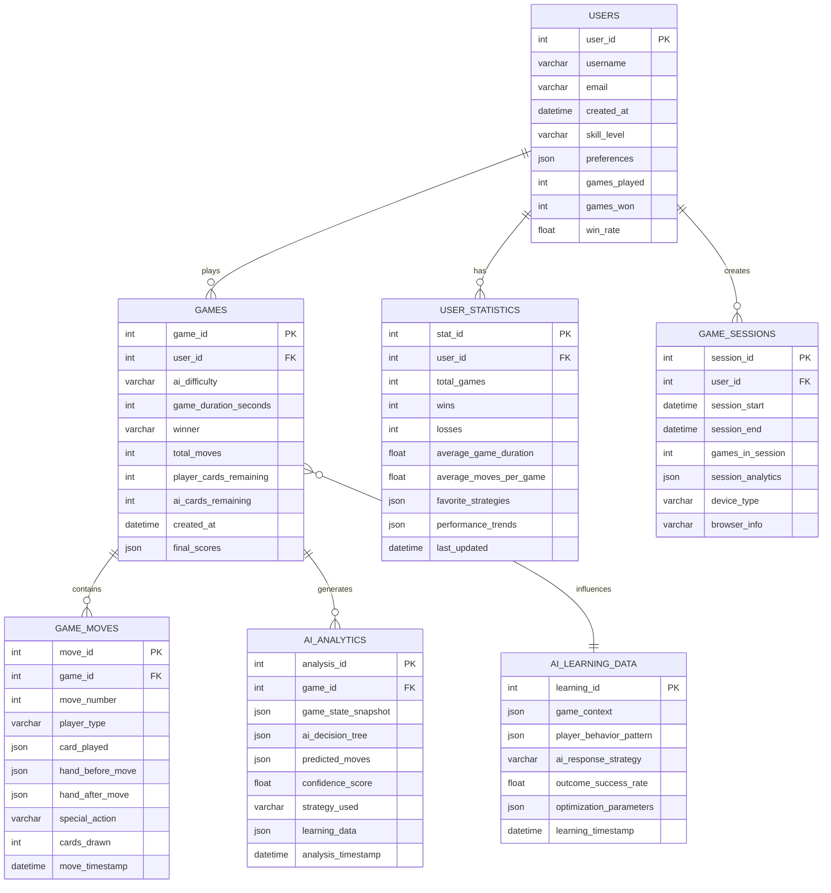

# Database Design - UNO AI Master

## Entity Relationship Diagram



## Table Specifications

### 1. USERS Table
**Purpose**: Store user information and basic statistics
```sql
CREATE TABLE users (
    user_id INT PRIMARY KEY AUTO_INCREMENT,
    username VARCHAR(50) UNIQUE NOT NULL,
    email VARCHAR(100) UNIQUE,
    created_at DATETIME DEFAULT CURRENT_TIMESTAMP,
    skill_level ENUM('Beginner', 'Intermediate', 'Advanced', 'Expert') DEFAULT 'Beginner',
    preferences JSON, -- AI difficulty preferences, UI settings, etc.
    games_played INT DEFAULT 0,
    games_won INT DEFAULT 0,
    win_rate DECIMAL(5,2) GENERATED ALWAYS AS (
        CASE WHEN games_played > 0 
        THEN (games_won / games_played) * 100 
        ELSE 0 END
    ) STORED,
    INDEX idx_username (username),
    INDEX idx_skill_level (skill_level)
);
```

### 2. GAMES Table
**Purpose**: Record individual game sessions
```sql
CREATE TABLE games (
    game_id INT PRIMARY KEY AUTO_INCREMENT,
    user_id INT NOT NULL,
    ai_difficulty ENUM('Easy', 'Medium', 'Hard') NOT NULL,
    game_duration_seconds INT,
    winner ENUM('Player', 'AI') NOT NULL,
    total_moves INT,
    player_cards_remaining INT DEFAULT 0,
    ai_cards_remaining INT DEFAULT 0,
    created_at DATETIME DEFAULT CURRENT_TIMESTAMP,
    final_scores JSON, -- {player: 150, ai: 75}
    FOREIGN KEY (user_id) REFERENCES users(user_id) ON DELETE CASCADE,
    INDEX idx_user_games (user_id, created_at),
    INDEX idx_winner (winner),
    INDEX idx_difficulty (ai_difficulty)
);
```

### 3. GAME_MOVES Table
**Purpose**: Track every move made during games for analysis
```sql
CREATE TABLE game_moves (
    move_id INT PRIMARY KEY AUTO_INCREMENT,
    game_id INT NOT NULL,
    move_number INT NOT NULL,
    player_type ENUM('Player', 'AI') NOT NULL,
    card_played JSON, -- {color: 'red', value: '7'} or null for draw
    hand_before_move JSON, -- Array of cards before move
    hand_after_move JSON, -- Array of cards after move
    special_action VARCHAR(20), -- 'skip', 'reverse', 'draw2', 'wild', etc.
    cards_drawn INT DEFAULT 0,
    move_timestamp DATETIME DEFAULT CURRENT_TIMESTAMP,
    FOREIGN KEY (game_id) REFERENCES games(game_id) ON DELETE CASCADE,
    INDEX idx_game_moves (game_id, move_number),
    INDEX idx_player_moves (player_type, move_timestamp)
);
```

### 4. AI_ANALYTICS Table
**Purpose**: Store AI decision-making data for SmythOS integration
```sql
CREATE TABLE ai_analytics (
    analysis_id INT PRIMARY KEY AUTO_INCREMENT,
    game_id INT NOT NULL,
    game_state_snapshot JSON, -- Complete game state at decision point
    ai_decision_tree JSON, -- SmythOS decision process
    predicted_moves JSON, -- AI predictions for next moves
    confidence_score DECIMAL(3,2), -- AI confidence in decision (0-1)
    strategy_used VARCHAR(50), -- 'aggressive', 'defensive', 'balanced'
    learning_data JSON, -- Data for machine learning improvement
    analysis_timestamp DATETIME DEFAULT CURRENT_TIMESTAMP,
    FOREIGN KEY (game_id) REFERENCES games(game_id) ON DELETE CASCADE,
    INDEX idx_ai_strategy (strategy_used),
    INDEX idx_confidence (confidence_score)
);
```

### 5. USER_STATISTICS Table
**Purpose**: Aggregated user performance data
```sql
CREATE TABLE user_statistics (
    stat_id INT PRIMARY KEY AUTO_INCREMENT,
    user_id INT NOT NULL,
    total_games INT DEFAULT 0,
    wins INT DEFAULT 0,
    losses INT DEFAULT 0,
    average_game_duration DECIMAL(8,2), -- Average seconds per game
    average_moves_per_game DECIMAL(6,2),
    favorite_strategies JSON, -- Most successful strategies
    performance_trends JSON, -- Win rate over time, improvement metrics
    last_updated DATETIME DEFAULT CURRENT_TIMESTAMP ON UPDATE CURRENT_TIMESTAMP,
    FOREIGN KEY (user_id) REFERENCES users(user_id) ON DELETE CASCADE,
    UNIQUE KEY unique_user_stats (user_id)
);
```

### 6. AI_LEARNING_DATA Table
**Purpose**: Machine learning dataset for AI improvement
```sql
CREATE TABLE ai_learning_data (
    learning_id INT PRIMARY KEY AUTO_INCREMENT,
    game_context JSON, -- Game state when decision was made
    player_behavior_pattern JSON, -- Pattern analysis of player moves
    ai_response_strategy VARCHAR(50),
    outcome_success_rate DECIMAL(3,2), -- How successful was this strategy
    optimization_parameters JSON, -- Parameters for AI tuning
    learning_timestamp DATETIME DEFAULT CURRENT_TIMESTAMP,
    INDEX idx_strategy_success (ai_response_strategy, outcome_success_rate),
    INDEX idx_learning_time (learning_timestamp)
);
```

### 7. GAME_SESSIONS Table
**Purpose**: Track user sessions for analytics
```sql
CREATE TABLE game_sessions (
    session_id INT PRIMARY KEY AUTO_INCREMENT,
    user_id INT NOT NULL,
    session_start DATETIME DEFAULT CURRENT_TIMESTAMP,
    session_end DATETIME,
    games_in_session INT DEFAULT 0,
    session_analytics JSON, -- Session-level metrics
    device_type VARCHAR(20), -- 'desktop', 'mobile', 'tablet'
    browser_info VARCHAR(100),
    FOREIGN KEY (user_id) REFERENCES users(user_id) ON DELETE CASCADE,
    INDEX idx_user_sessions (user_id, session_start)
);
```

## Data Relationships

### Primary Relationships
1. **Users → Games**: One user can play multiple games (1:N)
2. **Games → Game_Moves**: One game contains multiple moves (1:N)
3. **Games → AI_Analytics**: One game generates multiple AI analyses (1:N)
4. **Users → User_Statistics**: One user has one statistics record (1:1)
5. **Users → Game_Sessions**: One user can have multiple sessions (1:N)

### Analytics Relationships
- **AI_Learning_Data** is influenced by multiple games but not directly linked (N:M through analysis)
- **Game_Moves** and **AI_Analytics** are correlated by game_id and timestamps
- **User_Statistics** is derived from aggregating **Games** data

## Indexing Strategy

### Performance Indexes
```sql
-- Frequently queried combinations
CREATE INDEX idx_user_game_performance ON games(user_id, winner, created_at);
CREATE INDEX idx_ai_difficulty_analysis ON games(ai_difficulty, total_moves);
CREATE INDEX idx_move_analysis ON game_moves(game_id, player_type, move_number);

-- Analytics optimization
CREATE INDEX idx_ai_strategy_time ON ai_analytics(strategy_used, analysis_timestamp);
CREATE INDEX idx_learning_optimization ON ai_learning_data(outcome_success_rate, learning_timestamp);
```

## SmythOS Integration Points

### 1. Real-time Decision Making
- **Table**: `ai_analytics`
- **Usage**: Store SmythOS decision trees and confidence scores
- **Flow**: Game state → SmythOS → Decision analysis → Database

### 2. Learning Data Collection
- **Table**: `ai_learning_data`
- **Usage**: Feed player behavior patterns to SmythOS for improvement
- **Flow**: Game patterns → Analysis → SmythOS training data

### 3. Performance Optimization
- **Table**: `user_statistics`, `game_moves`
- **Usage**: Analyze player performance to adjust AI difficulty
- **Flow**: Historical data → SmythOS adaptation → Improved gameplay

## Scalability Considerations

### Partitioning Strategy
```sql
-- Partition games by date for better performance
ALTER TABLE games PARTITION BY RANGE (YEAR(created_at)) (
    PARTITION p2024 VALUES LESS THAN (2025),
    PARTITION p2025 VALUES LESS THAN (2026),
    PARTITION p_future VALUES LESS THAN MAXVALUE
);
```

### Archival Strategy
- Archive games older than 1 year to separate tables
- Keep AI learning data for continuous improvement
- Compress historical analytics data

This database design supports:
- ✅ Real-time game state management
- ✅ Comprehensive analytics and reporting
- ✅ SmythOS AI integration
- ✅ Scalable data architecture
- ✅ Performance optimization
- ✅ Machine learning data collection
